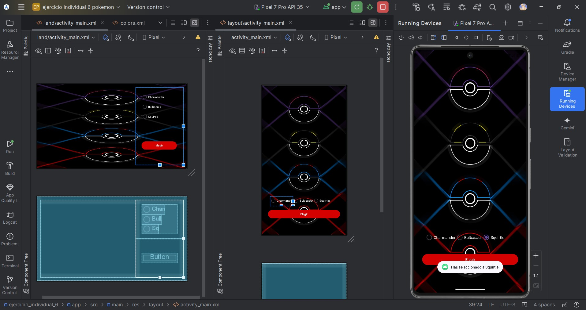

**_<h2 align="center">:vulcan_salute: Ejercicio Individual 10 - Pokémon :computer:</h2>_**

Proyecto realizado según los siguientes requerimientos:

## Cambio de Activity

Sí, continuamos con el __proyecto de Pokémon__. No nos podemos olvidar de él dejando un botón sin funcionamiento... _¿Lo recuerdas?_ __"Confirmar"__ sigue ahí esperando dar el siguiente paso.

1. Crea una nueva __Activity__ dentro del proyecto.
    - Recuerda que para este módulo utilizamos _Empty Views Activity_.

2. Junto a la __Activity__ se generará automáticamente su respectivo layout. Construye un TextView con un mensaje de bienvenida.

3. Vuelve un momento a la Activity anterior y __crea una función__ que permita navegar a la nueva __Activity__ en cuanto se le dé clic al botón de __"Confirmar"__.
    - Utiliza __Intent__ para navegar de una Activity a otra.

4. Es importante que conserves el nombre del __Pokémon__ seleccionado, es decir, ese dato también debe navegar a la nueva Activity.
    - _putExtra..._ __¡Ups!__

5. _¿Recuerdas el TextView creado en el punto 2?_ Deja el mensaje de bienvenida a un lado y entrégale el nombre del Pokémon seleccionado para que se visualice por pantalla cuando navegamos por primera vez a la __nueva Activity__.

